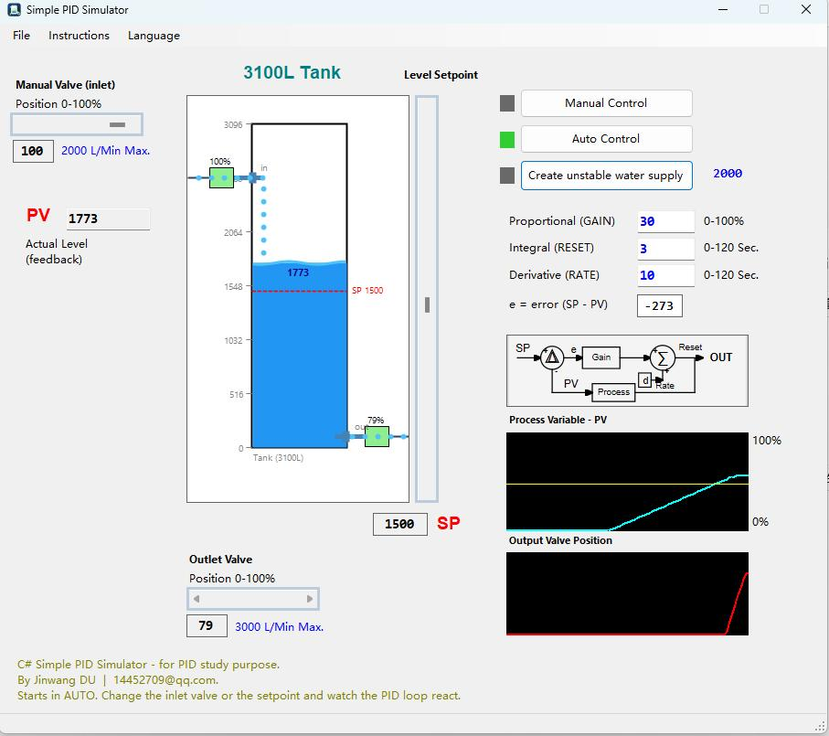

# **C# PID Simulator**

## **Development Environment**

The **C# PID Simulator** is a Windows desktop application developed using modern Microsoft technologies. It is intended as an educational tool for learning and experimenting with PID (Proportional–Integral–Derivative) control algorithms through a simulated water tank level control system.

### **Development Platform**

- **Framework:** .NET 8 (Windows Desktop)
- **Programming Language:** C#
- **IDE:** Microsoft Visual Studio 2022
- **UI Framework:** Windows Forms (WinForms)
- **Target Platform:** Windows7 / Windows 10 / Windows 11 (x64)

### **Code Overview**

The application is written in **C#** using the **.NET 8 Windows Forms** framework. The project adopts an event-driven architecture commonly used in desktop applications.

The simulator consists of several functional modules:

- **Simulation Engine**
    - Calculates the water tank dynamics.
    - Simulates inlet flow, outlet flow, and tank level.
    - Updates the process variable (PV) in real time.
- **PID Controller**
    - Implements a standard PID control algorithm.
    - Supports independent adjustment of:
        - Proportional Gain (P)
        - Integral Reset Time (I)
        - Derivative Rate (D)
    - Computes the controller output according to the error between SP and PV.
- **Graphical User Interface**
    - Built with Windows Forms.
    - Displays:
        - Water tank animation
        - Valve positions
        - Process Variable (PV)
        - Setpoint (SP)
        - Controller Output (CV)
        - Real-time trend charts
- **Real-Time Simulation**
    - Uses a periodic timer to update the simulation.
    - Refreshes process calculations and graphics continuously to emulate an industrial control loop.

### **Purpose**

This simulator is designed for:

- Learning PID control fundamentals
- Understanding process dynamics
- Practicing PID tuning
- Demonstrating industrial automation concepts
- Classroom teaching and laboratory exercises

# **Explanation of Proportional, Integral, Derivative (PID) Control**

The objective of this program is to examine a simplified PID control loop used in an industrial setting, in this case, a water tank with level control.

Because there are so many variations to PID control loops between manufacturers of controllers, I have chosen a basic algorithm that will allow you to experiment with each of the three PID variables.

The water tank is constructed of a tank with a manual input valve that the machine operator can control, a water tank with a level sensor, and an output valve that can either be controlled manually or be controlled by the computer using the PID control algorithm.

When the program starts, the system is already placed into automatic mode with a somewhat stable setting for the PID algorithm. The operator can alter the inlet valve position and see how the computer adjusts the output valve to maintain the level setpoint.

When you make changes to the PID variables, cause an upset by changing the setpoint (SP). This will show you, via the graphs, how well you are "tuning" the control loop.

## **Steps**

1. Alter the manual input valve and watch the PID loop in action.
2. With the manual input valve fully opened (100%), click the **Unstable Water Supply** button.
    - This button causes the main supply water to fluctuate, simulating disturbances found in real industrial processes.
    - Observe how the PID controller automatically compensates for these fluctuations.
3. Switch the system to **MANUAL CONTROL**.
    - You can now operate both the inlet valve and the outlet valve.
    - Try maintaining the tank level manually while the unstable water supply is enabled.
4. Change the level **Setpoint (SP)** and observe how the PID controller responds to the new target.

## **PID Parameters**

### **Proportional (GAIN)**

**Range:** 0–100%

Determines how much the controller output changes according to the error between the **Setpoint (SP)** and the **Process Variable (PV)**.

### **Integral (RESET)**

**Unit:** Seconds

Accumulates the error over time and removes the steady-state offset between the PV and SP.

### **Derivative (RATE)**

**Unit:** Seconds

Predicts future error based on the rate of change, improving response for slow or lagging processes and reducing overshoot.
